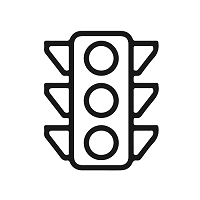

# 🚦 Erkenner

[](https://github.com/TayyabAsghar/Erkenner/watchers)
[](https://github.com/TayyabAsghar/Erkenner/stargazers)
[](https://github.com/TayyabAsghar/Erkenner/network/members)
[](https://github.com/TayyabAsghar/Erkenner)

<br>

[](https://github.com/TayyabAsghar/Erkenner)

# 🔍 Overview

Erkenner is a Traffic Sign Detection and Recognition app. User will simply click a picture by camera or add from the gallery to detect and recognize traffic signs present in the picture. The [German Traffic Sign Recognition Benchmark][gtsrb] was used to train and predict our model.

# 🌟 Features

## ☑️ Implemented

These are some working features of the app...

- `Select Image from Gallery` - We can select any image from galley.
- `Capture an Image` - Capture a picture through camera.
- `Dark Mode` - Change between dark 🌙 and light ☀️ mode theme.
- `Font Size` - Change font size to increase the readability.

## ☐ TodoList

There some major and small ideas that are still needs to be implemented...

- `Integration` - The app still needs to be integrated with the python code (which we have written) for detection and recognition. We could not complete this feature due to start of next semester.
- `Working Demo` - Plan is once the integration is completed we will add a small video of working demo on the home screen.
- `Update AboutUs` - Needs to update the screen of aboutUs through which users can reach us.

# ↓ Installation for ⚡️ Usage

```diff
- Unfortunately, there is no release of this project for now as it still missing it's major feature.
```

# ⚡️ Usage

Using it very simple.

- Install it
- Open it
- Click `Get Started` button or `Camera icon` on the top
- Click `Select Image`
- Select from `Camera` or `Gallery`
- `Click` or `Select` image

The result will be shown below the image.

# ↓ Installation for 🐱‍💻 Development

Erkenner system prerequisites

- [Flutter SDK][fsdk]
- [Android Studio][astudio]

Clone and change into the project

```sh
$ git clone https://github.com/TayyabAsghar/Erkenner.git
$ cd erkenner
```

Install packages

```sh
$ flutter pub get
```

Start developing!

# 👨🏻‍💻 CONTRIBUTORS

- [Muhammad Tayyab Asghar](https://github.com/TayyabAsghar)
- [Qasim Bin Asif](https://github.com/mrqasimasif)
- [Kinza Kanwal](https://github.com/kinzakanwal)
- [Sarah Farrukh](https://github.com/sarahfarrukh)
- Iqra Khalid

[gtsrb]: https://www.kaggle.com/meowmeowmeowmeowmeow/gtsrb-german-traffic-sign
[fsdk]: https://flutter.dev/docs/get-started/install
[astudio]: https://developer.android.com/studio
